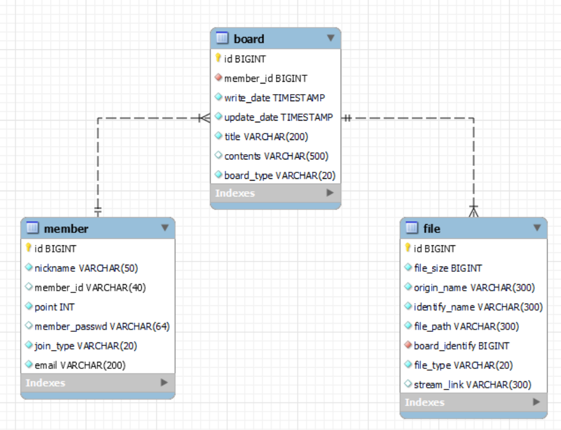

<h1>아직 미완성 입니다.</h1>

<h3> [ 프로젝트 개요 ] </h3>

3가지를 배우기 위해 토이 프로젝트를 시작했습니다.

1. 스트리밍 서비스를 통해 대용량 트래픽을 경험
2. Junit 을 이용한 능숙한 테스트 케이스 작성
3. JPA 기술 숙달  

<h3> [ 서비스 ] </h3>
1. RED5 스트리밍 서버를 이용하여 스트리밍 서비스 구현 
2. 게시글 서비스 와 연동하여 영화 시청에 대해 판매 가능
3. 소셜 로그인 구현

<h3> [ 기술적인 정리 ] </h3>

<h3> [ ERD ] </h3>

